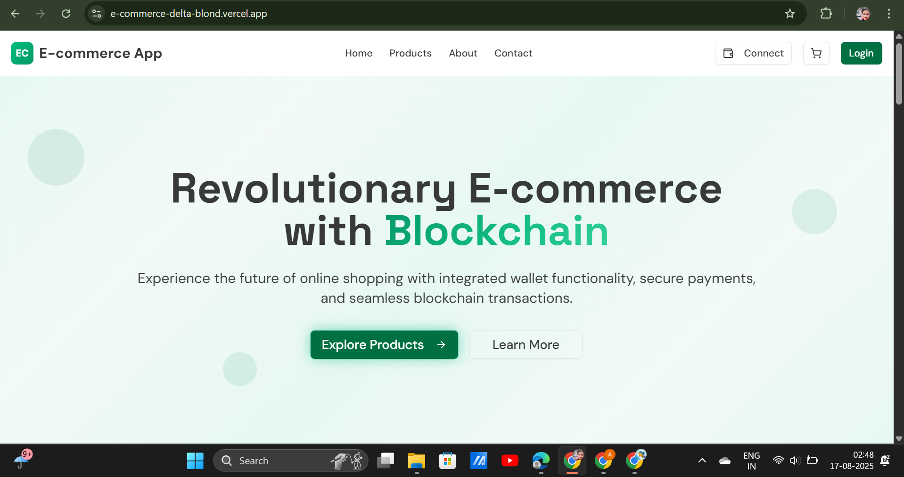
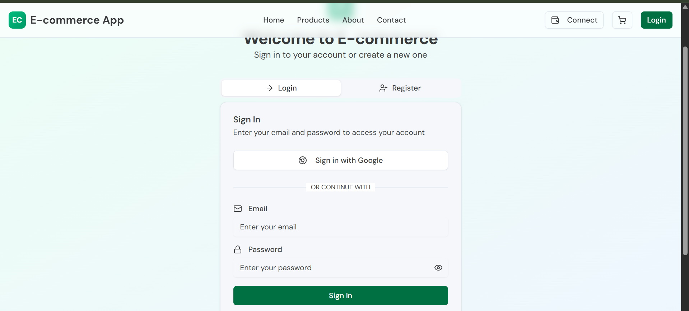
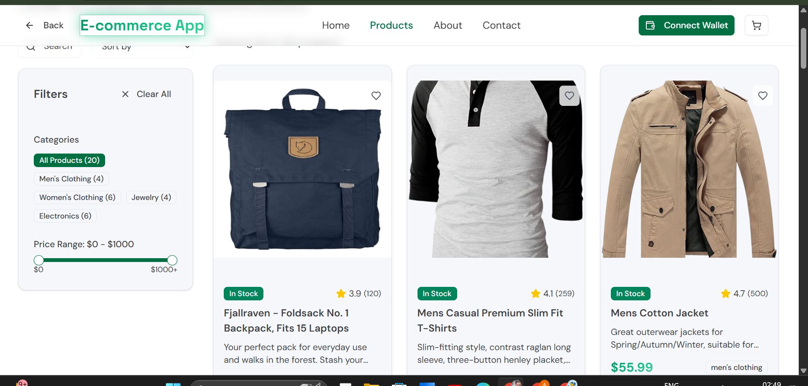

# 🛒 Modern E-commerce App with Blockchain Integration

[](https://nextjs.org/)
[](https://reactjs.org/)
[](https://www.typescriptlang.org/)
[](https://tailwindcss.com/)
[](https://opensource.org/licenses/MIT)

A revolutionary e-commerce platform built with Next.js, featuring integrated blockchain wallet functionality, secure payments, and modern UI/UX design. Experience the future of online shopping with seamless blockchain transactions and comprehensive product management.

## 📸 Screenshots

### 🏠 Home Page

*Modern homepage with blockchain integration and featured products*

### 🔐 Authentication System

*Secure login/registration with Google OAuth integration*

### 🛍️ Product Catalog

*Comprehensive product catalog with advanced filtering and search*

## ✨ Features

### 🚀 **Core E-commerce Features**
- **Product Management**: Complete catalog with categories, filters, and search
- **Shopping Cart**: Persistent cart with local storage
- **Checkout System**: Multi-step checkout with address selection
- **Order Management**: Order tracking and history
- **User Authentication**: Login/Register with Google OAuth

### ⛓️ **Blockchain Integration**
- **Wallet Connectivity**: MetaMask and other Web3 wallets
- **Blockchain Payments**: Secure cryptocurrency transactions
- **Smart Contract Integration**: Ethereum-based payment processing
- **Balance Management**: Real-time wallet balance tracking

### 💳 **Payment Systems**
- **Razorpay Integration**: Traditional payment methods
- **Cryptocurrency Payments**: Bitcoin, Ethereum, and other tokens
- **Payment Verification**: Secure transaction validation
- **Order Confirmation**: Automated payment processing

### 🗺️ **Advanced Features**
- **OpenStreetMap Integration**: Interactive address selection
- **Geolocation Services**: Automatic location detection
- **Address Validation**: Smart address completion
- **Shipping Calculator**: Dynamic shipping cost calculation

### 🎨 **Modern UI/UX**
- **Responsive Design**: Mobile-first approach
- **Dark/Light Theme**: System preference detection
- **Smooth Animations**: Framer Motion and CSS transitions
- **Accessibility**: WCAG 2.1 compliance
- **Component Library**: Radix UI with shadcn/ui

## 🛠️ **Technology Stack**

### **Frontend**
- **Framework**: Next.js 15.2.4 (App Router)
- **Language**: TypeScript 5.9.2
- **Styling**: Tailwind CSS 4.1.9
- **UI Components**: Radix UI + shadcn/ui
- **Icons**: Lucide React
- **Animations**: CSS Animations + Transitions

### **Backend & Database**
- **API**: Next.js API Routes
- **Authentication**: NextAuth.js with Google OAuth
- **Database**: MongoDB with Mongoose ODM
- **Session Storage**: Redis for session management
- **File Storage**: Local storage with public directory

### **Blockchain & Web3**
- **Web3 Library**: Ethers.js & Web3.js
- **Wallet Integration**: MetaMask, WalletConnect
- **Payment Processing**: Custom smart contracts
- **Network Support**: Ethereum, Polygon, BSC

### **Payment Integration**
- **Traditional Payments**: Razorpay
- **Cryptocurrency**: Multi-chain support
- **Security**: JWT tokens, bcrypt encryption

### **Maps & Location**
- **Mapping**: Leaflet with OpenStreetMap
- **Geocoding**: Nominatim API (no API key required)
- **Location Services**: Browser geolocation API

## 🚀 **Getting Started**

### **Prerequisites**
- Node.js 18.0 or later
- npm or yarn package manager
- Git for version control

### **Installation**

1. **Clone the repository**
   ```bash
   git clone https://github.com/AnuragTiwari1508/E-commerce.git
   cd E-commerce
   ```

2. **Install dependencies**
   ```bash
   npm install
   # or
   yarn install
   ```

3. **Environment Setup**
   
   Create a `.env.local` file in the root directory:
   ```env
   # NextAuth Configuration
   NEXTAUTH_URL=http://localhost:3000
   NEXTAUTH_SECRET=your_nextauth_secret_here
   
   # Google OAuth
   GOOGLE_CLIENT_ID=your_google_client_id
   GOOGLE_CLIENT_SECRET=your_google_client_secret
   
   # Razorpay Configuration
   RAZORPAY_KEY_ID=your_razorpay_key_id
   RAZORPAY_KEY_SECRET=your_razorpay_secret_key
   
   # Database
   MONGODB_URI=your_mongodb_connection_string
   
   # Redis (Optional)
   REDIS_URL=your_redis_connection_string
   
   # Blockchain (Optional)
   INFURA_PROJECT_ID=your_infura_project_id
   PRIVATE_KEY=your_wallet_private_key
   ```

4. **Run the development server**
   ```bash
   npm run dev
   # or
   yarn dev
   ```

5. **Open your browser**
   Navigate to [http://localhost:3000](http://localhost:3000)

## 📁 **Project Structure**

```
E-commerce/
├── app/                    # Next.js App Router
│   ├── api/               # API routes
│   │   ├── auth/          # Authentication APIs
│   │   └── payment/       # Payment processing
│   ├── about/             # About page
│   ├── cart/              # Shopping cart page
│   ├── checkout/          # Checkout process
│   ├── contact/           # Contact page
│   ├── login/             # Authentication page
│   ├── orders/            # Order management
│   ├── products/          # Product catalog
│   │   └── [id]/         # Individual product pages
│   ├── globals.css        # Global styles
│   ├── layout.tsx         # Root layout
│   └── page.tsx           # Homepage
├── components/            # Reusable components
│   ├── ui/               # UI component library
│   ├── address-map.tsx   # OpenStreetMap integration
│   ├── cart-provider.tsx # Cart state management
│   ├── navbar.tsx        # Navigation component
│   ├── payment/          # Payment components
│   ├── product-card.tsx  # Product display
│   └── wallet-provider.tsx # Web3 wallet integration
├── lib/                  # Utilities and configurations
│   ├── products.ts       # Product data and utilities
│   └── utils.ts          # Helper functions
├── public/               # Static assets
│   ├── product/         # Product images
│   ├── image.png        # Login page screenshot
│   ├── image1.png       # Homepage screenshot
│   └── image2.png       # Products page screenshot
├── hooks/               # Custom React hooks
├── styles/              # Additional stylesheets
└── package.json         # Dependencies and scripts
```

## 🏃‍♂️ **Available Scripts**

```bash
# Development server
npm run dev

# Production build
npm run build

# Start production server
npm start

# Code linting
npm run lint

# Type checking
npx tsc --noEmit
```

## 🌟 **Key Features Walkthrough**

### **1. User Authentication**
- **Login/Register**: Tabbed interface with email/password or Google OAuth
- **Session Management**: Persistent login state with NextAuth
- **User Profiles**: Dashboard with order history and settings

### **2. Product Management**
- **Catalog Browsing**: Grid layout with filtering and sorting
- **Product Details**: Comprehensive product pages with images and descriptions
- **Search & Filter**: Advanced search with category, price, and rating filters
- **Wishlist**: Save favorite products for later

### **3. Shopping Experience**
- **Add to Cart**: Smooth cart integration across all pages
- **Cart Management**: Quantity updates, item removal, price calculations
- **Checkout Process**: Multi-step checkout with address selection
- **Order Tracking**: Complete order history and status updates

### **4. Payment Processing**
- **Multiple Payment Methods**: Cards, UPI, wallets via Razorpay
- **Cryptocurrency Support**: Bitcoin, Ethereum, and other tokens
- **Secure Processing**: Encrypted payment data and verification
- **Order Confirmation**: Automated emails and notifications

### **5. Address & Shipping**
- **Interactive Maps**: OpenStreetMap integration for address selection
- **Geolocation**: Automatic location detection
- **Address Validation**: Smart completion and verification
- **Shipping Options**: Multiple delivery methods and cost calculation

## 🔧 **Configuration**

### **Razorpay Setup**
1. Create account at [Razorpay Dashboard](https://dashboard.razorpay.com)
2. Get API keys from Settings > API Keys
3. Add keys to `.env.local`

### **Google OAuth Setup**
1. Go to [Google Cloud Console](https://console.cloud.google.com/)
2. Create new project or select existing
3. Enable Google+ API
4. Create OAuth 2.0 credentials
5. Add authorized redirect URIs: `http://localhost:3000/api/auth/callback/google`

### **Database Setup**
1. Create MongoDB cluster at [MongoDB Atlas](https://www.mongodb.com/cloud/atlas)
2. Get connection string
3. Add to `.env.local` as `MONGODB_URI`

## 🚀 **Deployment**

### **Vercel (Recommended)**
```bash
npm install -g vercel
vercel
```

### **Docker**
```dockerfile
FROM node:18-alpine
WORKDIR /app
COPY package*.json ./
RUN npm ci --only=production
COPY . .
RUN npm run build
EXPOSE 3000
CMD ["npm", "start"]
```

### **Environment Variables for Production**
Ensure all environment variables are properly configured in your deployment platform.

## 🤝 **Contributing**

We welcome contributions! Please follow these steps:

1. Fork the repository
2. Create a feature branch (`git checkout -b feature/AmazingFeature`)
3. Commit your changes (`git commit -m 'Add some AmazingFeature'`)
4. Push to the branch (`git push origin feature/AmazingFeature`)
5. Open a Pull Request

## 📄 **License**

This project is licensed under the MIT License - see the [LICENSE](LICENSE) file for details.

## 👥 **Authors**

- **Anurag Tiwari** - *Initial work* - [@AnuragTiwari1508](https://github.com/AnuragTiwari1508)

## 🙏 **Acknowledgments**

- [Next.js](https://nextjs.org/) for the amazing React framework
- [Radix UI](https://www.radix-ui.com/) for accessible UI components
- [shadcn/ui](https://ui.shadcn.com/) for the beautiful component library
- [Tailwind CSS](https://tailwindcss.com/) for utility-first CSS framework
- [Leaflet](https://leafletjs.com/) for interactive maps
- [OpenStreetMap](https://www.openstreetmap.org/) for free mapping data
- [Razorpay](https://razorpay.com/) for payment processing
- [Vercel](https://vercel.com/) for seamless deployment

## 📞 **Support**

If you have any questions or need help with setup, please:
1. Check the [Issues](https://github.com/AnuragTiwari1508/E-commerce/issues) section
2. Create a new issue with detailed information
3. Contact: [your-email@example.com]

---

**⭐ Don't forget to give the project a star if you find it helpful!**

## 🔗 **Live Demo**

🌐 [Live Application](https://your-deployed-url.vercel.app)

---

*Built with ❤️ by Anurag Tiwari*
